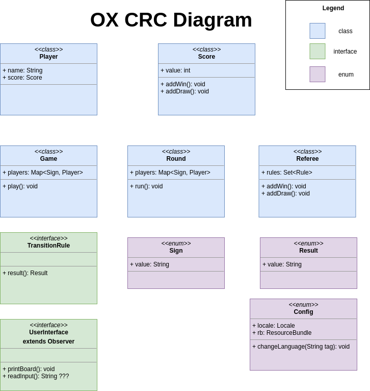

= OX Game

This is a simple tic-tac-toe game.

Project requirements:

- JDK 11
- Maven 3.6.2

Project should be build by Maven and run from jar.

All of the estimated tasks are stored in estimated.adoc file.

